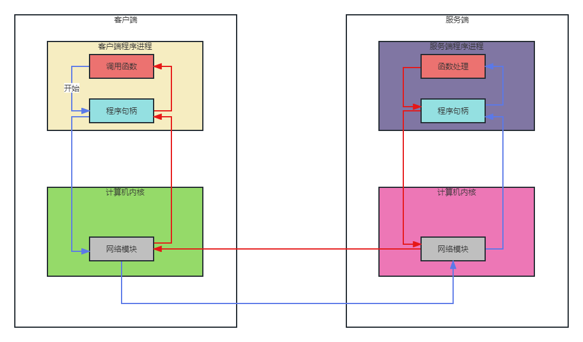

# RPC笔记

==手写一个RPC框架（Dubbo + Netty + Mybatis）==

**Remote Procedure Call** 远程过程调用协议，一种通过网络从远程计算机上请求服务，而不需要了解底层网络技术的协议。

RPC假定某些协议的存在，例如TCP/UDP等，为通信程序之间携带信息数据。

在OSI网络七层模型中，RPC跨越了**传输层**和**应用层**，RPC使得开发，包括网络分布式多程序在内的应用程序更加容易。


<span style="color:blue;">**过程是什么？**</span>

过程就是业务处理、计算任务，更直白的说，就是程序。

RPC的目的就是为了实现**像调用本地方法一样调用远程的过程**。


<span style="color:red;">**RPC模式及过程**</span>

RPC采用客户端/服务端的模式，通过request-response消息模式实现




RPC的三个过程：

1、通讯协议：比如你需要找人在国外干活，那么你可以直接飞过去或者打电话或者通过互联网的形式去找人，这个找人的过程就是通讯协议；

2、寻址：既然要找人干活，肯定要知道地址在哪里，飞过去需要找到详细地址，打电话需要知道电话号码，互联网需要知道IP地址；

3、数据序列化：就是说语言需要互通，才能够让别人干活，之间需要一个大家都懂的语言去交流。


[RPC是什么？](https://zhuanlan.zhihu.com/p/187560185)


## 用Java的方式启动Tomcat

一、首先创建一个maven父工程：**myRPC**


二、接着创建两个个maven子工程：**Consumer**、**Provider**


三、在Provider中定义服务**HelloServiceImpl**

```java
package com.djn;

public class HelloServiceImpl implements HelloService {

    @Override
    public String sayHello(String name) {
        return "hello: " + name;
    }
}
```


四、由于这个服务我们需要在Consumer中调用，

所以我们需要把它的实现接口拎出来：**Provider-Common**，以便在Consumer中引入并使用；

同时在Provider中引入该模块，以编写接口实现类。

```java
package com.djn;

public interface HelloService {

    public String sayHello(String name);
}
```


五、我们在Consumer中引入Provider-Common，方便我们后面调用服务


六、现在一切准备就绪，接着我们需要考虑**如何在Consumer中通过服务接口去调用指定的实现类**

这就需要用到RPC框架了


七、创建maven子项目**JiananRPC**，用以编写RPC框架


八、我们在JiananRPC中编写类用以启动**Tomcat**，并在Provider中引入调用

需要引入内置Tomcat依赖：

```xml
<dependency>
    <groupId>org.apache.tomcat.embed</groupId>
    <artifactId>tomcat-embed-core</artifactId>
    <version>9.0.65</version>
</dependency>
```


```java
package com.djn.protocol;

import org.apache.catalina.*;
import org.apache.catalina.connector.Connector;
import org.apache.catalina.core.StandardContext;
import org.apache.catalina.core.StandardEngine;
import org.apache.catalina.core.StandardHost;
import org.apache.catalina.startup.Tomcat;

/**
 * Name: HttpServer
 * Description:Tomcat启动类
 * Copyright: Copyright (c) 2023 MVWCHINA All rights Reserved
 * Company: 江苏医视教育科技发展有限公司
 *
 * @author 丁佳男
 * @version 1.0
 * @since 2023-03-13 14:22
 */
public class HttpServer {

    public void start(String hostname, Integer port) {
        //读取用户的配置 server.name=tomcat | netty
        Tomcat tomcat = new Tomcat();

        Server server = tomcat.getServer();
        Service service = server.findService("Tomcat");

        Connector connector = new Connector();
        connector.setPort(port);

        Engine engine = new StandardEngine();
        engine.setDefaultHost(hostname);

        Host host = new StandardHost();
        host.setName(hostname);

        String contextPath = "";
        StandardContext context = new StandardContext();
        context.setPath(contextPath);
        context.addLifecycleListener(new Tomcat.FixContextListener());

        host.addChild(context);
        engine.addChild(host);

        service.setContainer(engine);
        service.addConnector(connector);

        try {
            tomcat.start();
            tomcat.getServer().await();
        } catch (LifecycleException e) {
            e.printStackTrace();
        }
    }
}
```


```java
package com.djn;

import com.djn.protocol.HttpServer;

public class Provider {

    public static void main(String[] args) {
        //通过Netty、Tomcat等来接收网络请求
        HttpServer httpServer = new HttpServer();
        httpServer.start("localhost", 8080);
    }
}
```

运行Provider中的main方法，测试是否可以启动Tomcat


## 提供者如何处理RPC请求

在Provider中定义请求处理类**DispatcherServlet**：

```java
package com.djn.protocol;

import javax.servlet.ServletException;
import javax.servlet.http.HttpServlet;
import javax.servlet.http.HttpServletRequest;
import javax.servlet.http.HttpServletResponse;
import java.io.IOException;

public class DispatcherServlet extends HttpServlet {

    @Override
    protected void service(HttpServletRequest req, HttpServletResponse resp) throws ServletException, IOException {
        new HttpServerHandler().handler(req, resp);
    }
}
```


考虑到到扩展性，我们将处理请求的动作单独抽离成**HttpServerHandler**，

这样我们可以在DispatcherServlet中调用多个Handler来对请求做不同处理：

```java
package com.djn.protocol;

import com.djn.common.Invocation;

import javax.servlet.http.HttpServletRequest;
import javax.servlet.http.HttpServletResponse;
import java.io.IOException;
import java.io.ObjectInputStream;

public class HttpServerHandler {

    public void handler(HttpServletRequest req, HttpServletResponse resp) {
        //处理请求 --> 请求要求调用哪个接口、哪个方法、传了哪些方法参数
    }
}

```


其实对于任何传来的调用请求，有用的信息都只有三样：调用哪个接口、调用哪个方法、传入哪些方法参数，

所以我们可以将这些信息抽成一个类**Invocation**：

```java
package com.djn.common;

import java.io.Serializable;

//实现序列化接口，以防使用JDK序列化等
public class Invocation implements Serializable {

    private String interfaceName;
    private String methodName;
    private Class<Object>[] parameterTypes;
    private Object[] parameters;

    public Invocation(String interfaceName, String methodName, Class<Object>[] parameterTypes, Object[] parameters) {
        this.interfaceName = interfaceName;
        this.methodName = methodName;
        this.parameterTypes = parameterTypes;
        this.parameters = parameters;
    }


    public String getInterfaceName() {
        return interfaceName;
    }

    public void setInterfaceName(String interfaceName) {
        this.interfaceName = interfaceName;
    }

    public String getMethodName() {
        return methodName;
    }

    public void setMethodName(String methodName) {
        this.methodName = methodName;
    }

    public Class<Object>[] getParameterTypes() {
        return parameterTypes;
    }

    public void setParameterTypes(Class<Object>[] parameterTypes) {
        this.parameterTypes = parameterTypes;
    }

    public Object[] getParameters() {
        return parameters;
    }

    public void setParameters(Object[] parameters) {
        this.parameters = parameters;
    }
}
```


在Tomcat启动类中设置用DispatcherServlet处理接收到的请求：

```java
//设置用DispatcherServlet处理接收到的请求
tomcat.addServlet(contextPath, "dispatcher", new DispatcherServlet());
context.addServletMappingDecoded("/*", "dispatcher");
```


## 服务的本地注册和多版本实现

在HttpServletHandler中读取request，拿到 Invocation，

并通过接口名去获取对应的实现类，利用反射去执行方法，并通过**commons-io**把返回结果写入response：

```xml
<dependency>
    <groupId>org.apache.commons</groupId>
    <artifactId>commons-io</artifactId>
    <version>1.3.2</version>
</dependency>
```


```java
public void handler(HttpServletRequest req, HttpServletResponse resp) {
    //处理请求 --> 请求要求调用哪个接口、哪个方法、传了哪些方法参数
    try {
        //获取Invocation对象
        Invocation invocation = (Invocation) new ObjectInputStream(req.getInputStream()).readObject();
        //获取接口名
        String interfaceName = invocation.getInterfaceName();

        //从本地注册中获取实现类
        Class classImpl = LocalRegister.get(interfaceName, "1.0");
        //获取调用方法
        Method method = classImpl.getMethod(invocation.getMethodName(), invocation.getParameterTypes());
        //利用反射执行方法
        String result = (String) method.invoke(classImpl.newInstance(), invocation.getParameters());

        //将方法执行返回的结果写入response
        IOUtils.write(result, resp.getOutputStream());
    } catch (Exception e) {
        e.printStackTrace();
    }
}
```


关于如何通过接口名去获取对应的实现类，这里就需要用到注册，

注册分两种：本地注册、注册中心，我们使用本地注册，

考虑到一个服务接口可能有多个实现类，每一个都需要注册，所以加上版本用以区分：

```java
package com.djn.register;

import java.util.HashMap;
import java.util.Map;

public class LocalRegister {

    private static final Map<String, Class> map = new HashMap<>();

    public static void register(String interfaceName, String version, Class implClass) {
        map.put(interfaceName + version, implClass);
    }

    public static Class get(String interfaceName, String version) {
        return map.get(interfaceName + version);
    }
}
```


我们注册HelloService的两个实现类：

```java
public static void main(String[] args) {
    //注册HelloService的两个实现类
    LocalRegister.register(HelloService.class.getName(), "1.0", HelloServiceImpl.class);
    LocalRegister.register(HelloService.class.getName(), "2.0", HelloServiceImpl2.class);

    //通过Netty、Tomcat等来接收网络请求
    HttpServer httpServer = new HttpServer();
    httpServer.start("localhost", 8080);
}
```


## 消费者发起Invocation调用

//TODO